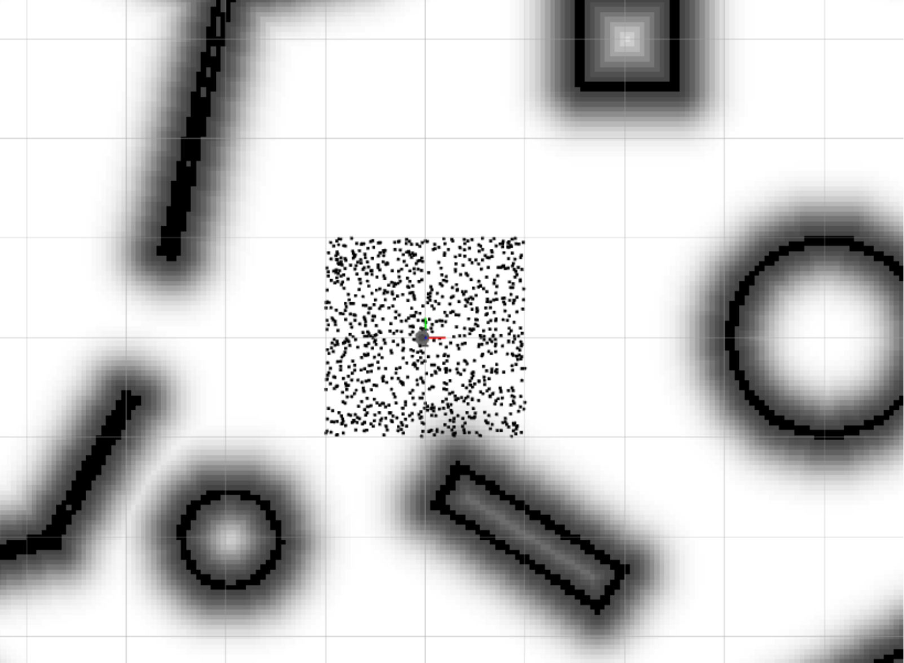
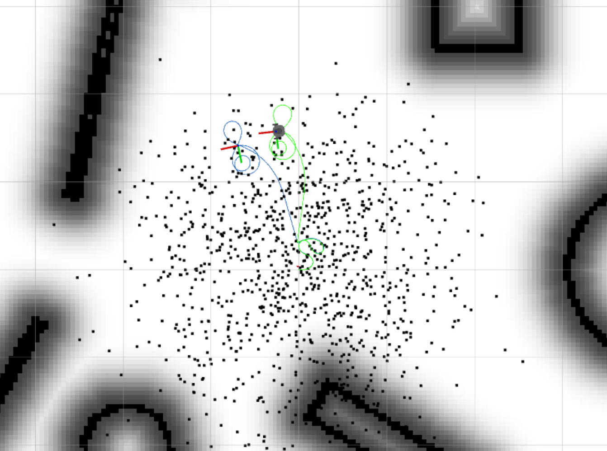

# TP3-PRA-LopezVilaclara

PARA CORRER EL CÓDIGO:
- colcon build
- source install/setup.bash
- export TURTLEBOT3_MODEL=burger
- **Terminal 1:** ros2 launch turtlebot3_custom_simulation custom_room.launch.py
- **Terminal 2:** ros2 launch custom_code launch_my_particles.launch.py
- **Terminal 3:** ros2 run turtlebot3_teleop teleop_keyboard

TAREAS PENDIENTES:
- Completar la función **map_callback** en el nodo likelihood.py (Hecho, chequear en compu de LINAR)
- Completar los métodos **move_odom**, **get_selected_state** y **update_particles** de la clase particle en el nodo robot_functions.py

NOTAS:
- Si completaron correctamente el codigo de map_callback, deberían ver algo como lo siguiente al lanzar todo nuevamente:

- Si hicieron move_odom y get_selected state correctamente, ahora verán que las partículas se mueven y se grafica la línea roja. Es posible que no se vea claramente la línea roja ya que como las partículas se mueven en orientaciones random no hay una dirección preferencial.

- Si con las 1000 partículas default corre lento, probar con menos: ros2 launch custom_code launch_my_particles.launch.py num_particles:=500
- Si se completó el update_particles correctamente verán que, al mover el robot con el nodo del teclado, ahora las partículas convergen a la posición real del robot, y que el camino rojo sigue el camino verde.